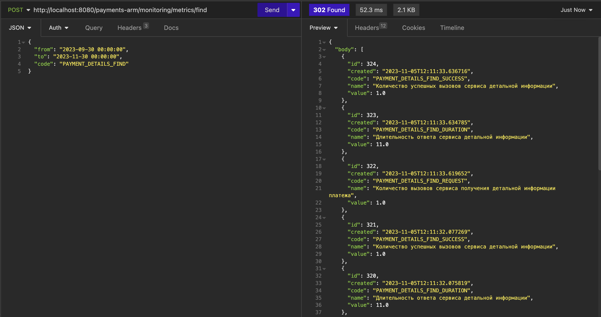

# arm_payments
Проект "АРМ Платежи"

[![github actions][actions-image]][actions-url]
[![coverage][codecov-image]][codecov-url]

## Ипользуемые технологии

Java, SpringBoot, Spring AOP, Spring Data, Spring Security, PostgreSQL, JUnit, Maven

Веб-приложение по администрированию и сопровождению платежей клиента. В системе реализована ролевая модель доступа
к REST-сервисам. Доступен просмотр журнала с логами и мониторинг времени выполнения запросов пользователя.

Возможности приложения:
- Регистрация пользователя.
- Авторизация пользователя.
- Просмотр платежей клиента по различным фильтрам.
- Настройка типов платежей: создание, обновление, удаление.
- Просмотр журналирования приложения.
- Мониторинг приложения.
- Управление параметрами приложения.

### Архитектура приложения трехслойная
- Слой контроллеры (прием запросов, проверка доступа, валидация, мониторинг и формирование ответа).
- Слой сервисы (бизнес логика приложения).
- Слой работы с БД (DAO-библиотека).

### Подготовка к запуску приложения
- Создать БД accidents хост `jdbc:postgresql://localhost:5432/payments`
- Собрать jar с приложением, выполнив команду `mvn install`
- Запустить приложение из папки target, выполнив команду: `java -jar arm_payments-1.0-SNAPSHOT.jar`

### Таблицы PostgreSQL DB
Таблицы базы данных написаны с помощью Liquibase. Схема БД:

### Структура проекта

## Сервис регистрации пользователя

Сервис <b> /payments-arm/registration/signUp <b>

### Контракт запроса

Объект типа <b> RegistrationRequest <b>

| body     | Тип    | Обязательность | Наименнование      | Валидация |
|----------|--------|:--------------:|--------------------|-----------|
| login    | String |       1        | Логин              |           |
| password | String |       1        | Пароль             |           |
| email    | String |       1        | Почтовый ящик      |           |

### Контракт ответа

Возможные httpStatus - created, bad_request, forbidden

Пример:

`http://localhost:8080/payments-arm/registration/signUp`

## Сервис авторизации пользователя

Сервис <b> /payments-arm/login <b>

### Контракт запроса

| body     | Тип    | Обязательность | Наименнование      | Валидация |
|----------|--------|:--------------:|--------------------|-----------|
| login    | String |       1        | Логин              |           |
| password | String |       1        | Пароль             |           |

### Контракт ответа

| headers       | Тип     | Обязательность | Наименнование     |
|---------------|---------|:--------------:|-------------------|
| Authorization | String  |       0        | Токен авторизации |

Возможные httpStatus - ok, bad_request, forbidden

Примечание: во все ниже описанные сервисы в headers запроса требуется передать токен авторизации в поле Authorization.

Пример:

`http://localhost:8080/payments-arm/login`

## Сервис получения списка платежей клиента

Сервис <b> /payments-arm/payment/list/find <b>

### Контракт запроса

Объект типа <b> PaymentListRequest <b>

| body       | Тип                | Обязательность | Наименнование                        | Валидация                |
|------------|--------------------|:--------------:|--------------------------------------|--------------------------|
| paymentId  | String             |       0        | Идентификатор платежа                | Паттерн: ^[A-z0-9-]{36}$ |
| clientId   | String             |       0        | Идентификатор клиента                |                          |
| from       | LocalDateTime      |       0        | Дата нижней границы фильтрации       | yyyy-MM-dd HH:mm:ss      |
| to         | LocalDateTime      |       0        | Дата верхней границы фильтрации      | yyyy-MM-dd HH:mm:ss      |
| offset     | Integer            |       1        | Смещение относительно начала выборки |                          |
| pageSize   | Integer            |       1        | Количество записей на одной странице |                          |

### Контракт ответа

Список объектов типа <b> PaymentListResponse <b>

| body            | Тип                | Обязательность | Наименнование         |
|-----------------|--------------------|:--------------:|-----------------------|
| paymentId       | String             |       1        | Идентификатор платежа |
| clientId        | String             |       1        | Идентификатор клиента |
| creationDate    | LocalDateTime      |       1        | Дата создания         |
| amount          | String             |       0        | Сумма платежа         |
| currency        | String             |       0        | Валюта платежа        |
| organization    | String             |       0        | Организация           |
| type            | String             |       1        | Тип платежа           |
| typeDescription | String             |       1        | Описание типа платежа |
| description     | String             |       0        | Описание платежа      |

Возможные httpStatus - found, bad_request, forbidden

Пример:

`http://localhost:8080/payments-arm/payment/list/find`

## Сервис получения детальной информации платежа клиента

Сервис <b> /payments-arm/payment/details/get <b>

### Контракт запроса

Объект типа <b> PaymentDetailsRequest <b>

| body       | Тип                | Обязательность | Наименнование                        | Валидация                |
|------------|--------------------|:--------------:|--------------------------------------|--------------------------|
| paymentId  | String             |       1        | Идентификатор платежа                | Паттерн: ^[A-z0-9-]{36}$ |

### Контракт ответа

Объект типа <b> PaymentDetailsResponse <b>

| body            | Тип                | Обязательность | Наименнование         |
|-----------------|--------------------|:--------------:|-----------------------|
| paymentId       | String             |       1        | Идентификатор платежа |
| clientId        | String             |       1        | Идентификатор клиента |
| creationDate    | LocalDateTime      |       1        | Дата создания         |
| amount          | String             |       0        | Сумма платежа         |
| currency        | String             |       0        | Валюта платежа        |
| organization    | String             |       0        | Организация           |
| type            | String             |       1        | Тип платежа           |
| typeDescription | String             |       1        | Описание типа платежа |
| description     | String             |       0        | Описание платежа      |

Возможные httpStatus - found, bad_request, forbidden

Пример:

`http://localhost:8080/payments-arm/payment/details/get`

## Сервис получения списка типов платежей

Сервис <b> /payments-arm/payment/types/find <b>

### Контракт запроса

Объект типа <b> PaymentTypesFindRequest <b>

| body        | Тип    | Обязательность | Наименнование         | Валидация                    |
|-------------|--------|:--------------:|-----------------------|------------------------------|
| type        | String |       0        | Тип платежа           | Паттерн: ^[A-z]{1,50}$       |
| description | String |       0        | Описание типа платежа | Паттерн: ^[A-zА-яё ]{1,100}$ |

### Контракт ответа

Список объектов типа <b> PaymentTypesFindResponse <b>

| body        | Тип    | Обязательность | Наименнование         |
|-------------|--------|:--------------:|-----------------------|
| type        | String |       1        | Тип платежа           |
| description | String |       1        | Описание типа платежа |

Возможные httpStatus - found, bad_request, forbidden

Пример:

`http://localhost:8080/payments-arm/payment/types/find`

## Сервис вставки типа платежа

Сервис <b> /payments-arm/payment/type/merge <b>

### Контракт запроса

Объект типа <b> MergePaymentTypeRequest <b>

| body        | Тип    | Обязательность | Наименнование         | Валидация                    |
|-------------|--------|:--------------:|-----------------------|------------------------------|
| type        | String |       1        | Тип платежа           | Паттерн: ^[A-z]{1,50}$       |
| description | String |       1        | Описание типа платежа | Паттерн: ^[A-zА-яё ]{1,100}$ |

### Контракт ответа

Возможные httpStatus - ok, bad_request, forbidden

Пример:

`http://localhost:8080/payments-arm/payment/type/merge`

## Сервис удаления типа платежа

Сервис <b> /payments-arm/payment/type/delete <b>

### Контракт запроса

Объект типа <b> DeletePaymentTypeRequest <b>

| body        | Тип    | Обязательность | Наименнование | Валидация              |
|-------------|--------|:--------------:|---------------|------------------------|
| type        | String |       1        | Тип платежа   | Паттерн: ^[A-z]{1,50}$ |

### Контракт ответа

Возможные httpStatus - ok, bad_request, forbidden

Пример:

`http://localhost:8080/payments-arm/payment/type/delete`

## Сервис получения получения записей системного журнала

Сервис <b> /payments-arm/logger/systemJournal/find <b>

### Контракт запроса

Объект типа <b> SystemJournalRequest <b>

| body       | Тип           | Обязательность | Наименнование                   | Валидация           |
|------------|---------------|:--------------:|---------------------------------|---------------------|
| from       | LocalDateTime |       1        | Дата нижней границы фильтрации  | yyyy-MM-dd HH:mm:ss |
| to         | LocalDateTime |       1        | Дата верхней границы фильтрации | yyyy-MM-dd HH:mm:ss |
| level      | List<String>  |       0        | Список уровеней логирования     |                     |
| message    | String        |       0        | Запись журнала                  |                     |
| parameters | String        |       0        | Параметры логирования           |                     |
| className  | String        |       0        | Имя класса                      |                     |
| trace      | String        |       0        | Трассировка                     |                     |

### Контракт ответа

Список объектов типа <b> SystemJournalResponse <b>

| body       | Тип           | Обязательность | Наименнование         |
|------------|---------------|:--------------:|-----------------------|
| id         | Integer       |       1        | Идентификатор записи  |
| level      | String        |       0        | Уровень логирования   |
| created    | LocalDateTime |       0        | Дата и время записи   |
| message    | String        |       0        | Запись журнала        |
| parameters | String        |       0        | Параметры логирования |
| className  | String        |       0        | Имя класса            |
| trace      | String        |       0        | Трассировка           |

Возможные httpStatus - found, bad_request, forbidden

Пример:

`http://localhost:8080/payments-arm/logger/systemJournal/find`

## Сервис получения получения метрик мониторинга

Сервис <b> /payments-arm/monitoring/metrics/find <b>

### Контракт запроса

Объект типа <b> MonitoringRequest <b>

| body | Тип           | Обязательность | Наименнование                   | Валидация           |
|------|---------------|:--------------:|---------------------------------|---------------------|
| from | LocalDateTime |       1        | Дата нижней границы фильтрации  | yyyy-MM-dd HH:mm:ss |
| to   | LocalDateTime |       1        | Дата верхней границы фильтрации | yyyy-MM-dd HH:mm:ss |
| code | String        |       1        | Код метрики                     |                     |

### Контракт ответа

Список объектов типа <b> MonitoringResponse <b>

| body    | Тип           | Обязательность | Наименнование        |
|---------|---------------|:--------------:|----------------------|
| id      | Integer       |       1        | Идентификатор записи |
| created | LocalDateTime |       1        | Дата и время записи  |
| code    | String        |       1        | Код метрики          |
| name    | String        |       1        | Название метрики     |
| value   | Double        |       1        | Значение метрики     |

Возможные httpStatus - found, bad_request, forbidden

Пример:

`http://localhost:8080/payments-arm/monitoring/metrics/find`

## Ролевая модель

| Роль                  | Описание                          | Доступные сервисы                                                        |
|-----------------------|-----------------------------------|--------------------------------------------------------------------------|
| view.payments         | Просмотр платежей                 | /payments-arm/payment/list/find   /payments-arm/payment/details/get  |
| edit.payments         | Редактирование платежей           |                                                                          |
| view.paymentTypes     | Просмотр типов платежей           | /payments-arm/payment/types/find                                         |
| edit.paymentTypes     | Редактирование типов платежей     | /payments-arm/payment/type/merge   /payments-arm/payment/type/delete |
| view.systemJournal    | Просмотр системного журнала       | /payments-arm/logger/systemJournal/find                                  |
| edit.systemJournal    | Редактирование системного журнала |                                                                          |
| view.metricMonitoring | Просмотр метрик мониторинга       |                                                                          |
| edit.metricMonitoring | Редактирование метрик мониторинга | /payments-arm/monitoring/metrics/find                                    |

## События журналирования

<table>
    <thead>
        <tr>
            <th>Сервис</th>
            <th>Код события</th>
            <th>Описание события</th>
            <th>Уровень логирования</th>
        </tr>
    </thead>
    <tbody>
        <tr>
            <td rowspan=5>/payments-arm/payment/list/find</td>
            <td>PAYMENT0001</td>
            <td>Вызов сервиса получения списка платежей</td>
            <td style="text-align: center; vertical-align: middle;">INFO</td>
        </tr>
        <tr>
            <td>PAYMENT0002</td>
            <td>Успешный ответ от сервиса получения списка платежей</td>
            <td style="text-align: center; vertical-align: middle;">INFO</td>
        </tr>
        <tr>
            <td>PAYMENT0003</td>
            <td>Ошибка в ответе сервиса получения списка платежей</td>
            <td style="text-align: center; vertical-align: middle;">ERROR</td>
        </tr>
        <tr>
            <td>PAYMENT0014</td>
            <td>Не пройдена валидация параметров запроса списка платежей</td>
            <td style="text-align: center; vertical-align: middle;">ERROR</td>
        </tr>
        <tr>
            <td>PAYMENT0017</td>
            <td>Сервис получения списка платежей отключен</td>
            <td style="text-align: center; vertical-align: middle;">ERROR</td>
        </tr>
        <tr>
            <td rowspan=5>/payments-arm/payment/details/get</td>
            <td>PAYMENT0004</td>
            <td>Вызов сервиса получения детальной информации платежа</td>
            <td style="text-align: center; vertical-align: middle;">INFO</td>
        </tr>
        <tr>
            <td>PAYMENT0005</td>
            <td>Успешный ответ от сервиса получения детальной информации платежа</td>
            <td style="text-align: center; vertical-align: middle;">INFO</td>
        </tr>
        <tr>
            <td>PAYMENT0006</td>
            <td>Ошибка в ответе сервиса получения детальной информации платежа</td>
            <td style="text-align: center; vertical-align: middle;">ERROR</td>
        </tr>
        <tr>
            <td>PAYMENT0013</td>
            <td>Не пройдена валидация параметров запроса детальной информации платежа</td>
            <td style="text-align: center; vertical-align: middle;">ERROR</td>
        </tr>
        <tr>
            <td>PAYMENT0018</td>
            <td>Сервис получения детальной информации отключен</td>
            <td style="text-align: center; vertical-align: middle;">ERROR</td>
        </tr>
        <tr>
            <td rowspan=5>/payments-arm/payment/types/find</td>
            <td>PAYMENT0021</td>
            <td>Вызов сервиса получения списка типов платежей</td>
            <td style="text-align: center; vertical-align: middle;">INFO</td>
        </tr>
        <tr>
            <td>PAYMENT0022</td>
            <td>Успешный ответ от сервиса получения списка типов платежей</td>
            <td style="text-align: center; vertical-align: middle;">INFO</td>
        </tr>
        <tr>
            <td>PAYMENT0023</td>
            <td>Ошибка в ответе сервиса получения списка типов платежей</td>
            <td style="text-align: center; vertical-align: middle;">ERROR</td>
        </tr>
        <tr>
            <td>PAYMENT0025</td>
            <td>Не пройдена валидация параметров запроса списка типов платежей</td>
            <td style="text-align: center; vertical-align: middle;">ERROR</td>
        </tr>
        <tr>
            <td>PAYMENT0024</td>
            <td>Сервис получения списка типов платежей отключен</td>
            <td style="text-align: center; vertical-align: middle;">ERROR</td>
        </tr>
        <tr>
            <td rowspan=5>/payments-arm/payment/type/merge</td>
            <td>PAYMENT0026</td>
            <td>Вызов сервиса вставки типа платежа</td>
            <td style="text-align: center; vertical-align: middle;">INFO</td>
        </tr>
        <tr>
            <td>PAYMENT0027</td>
            <td>Успешный ответ от сервиса вставки типа платежа</td>
            <td style="text-align: center; vertical-align: middle;">INFO</td>
        </tr>
        <tr>
            <td>PAYMENT0028</td>
            <td>Ошибка в ответе сервиса вставки типа платежа</td>
            <td style="text-align: center; vertical-align: middle;">ERROR</td>
        </tr>
        <tr>
            <td>PAYMENT0030</td>
            <td>Не пройдена валидация параметров запроса вставки типа платежа</td>
            <td style="text-align: center; vertical-align: middle;">ERROR</td>
        </tr>
        <tr>
            <td>PAYMENT0029</td>
            <td>Сервис вставки типа платежа отключен</td>
            <td style="text-align: center; vertical-align: middle;">ERROR</td>
        </tr>
        <tr>
            <td rowspan=5>/payments-arm/payment/type/delete</td>
            <td>PAYMENT0031</td>
            <td>Вызов сервиса удаления типа платежа</td>
            <td style="text-align: center; vertical-align: middle;">INFO</td>
        </tr>
        <tr>
            <td>PAYMENT0032</td>
            <td>Успешный ответ от сервиса удаления типа платежа</td>
            <td style="text-align: center; vertical-align: middle;">INFO</td>
        </tr>
        <tr>
            <td>PAYMENT0033</td>
            <td>Ошибка в ответе сервиса удаления типа платежа</td>
            <td style="text-align: center; vertical-align: middle;">ERROR</td>
        </tr>
        <tr>
            <td>PAYMENT0035</td>
            <td>Не пройдена валидация параметров запроса удаления типа платежа</td>
            <td style="text-align: center; vertical-align: middle;">ERROR</td>
        </tr>
        <tr>
            <td>PAYMENT0034</td>
            <td>Сервис удаления типа платежа отключен</td>
            <td style="text-align: center; vertical-align: middle;">ERROR</td>
        </tr>
        <tr>
            <td rowspan=5>/payments-arm/monitoring/metrics/find</td>
            <td>PAYMENT0010</td>
            <td>Вызов сервиса получения метрик мониторинга</td>
            <td style="text-align: center; vertical-align: middle;">INFO</td>
        </tr>
        <tr>
            <td>PAYMENT0011</td>
            <td>Успешный ответ от сервиса получения метрик мониторинга</td>
            <td style="text-align: center; vertical-align: middle;">INFO</td>
        </tr>
        <tr>
            <td>PAYMENT0012</td>
            <td>Ошибка в ответе сервиса получения метрик мониторинга</td>
            <td style="text-align: center; vertical-align: middle;">ERROR</td>
        </tr>
        <tr>
            <td>PAYMENT0015</td>
            <td>Не пройдена валидация параметров запроса метрик монторинга</td>
            <td style="text-align: center; vertical-align: middle;">ERROR</td>
        </tr>
        <tr>
            <td>PAYMENT0019</td>
            <td>Сервис получения метрик мониторинга</td>
            <td style="text-align: center; vertical-align: middle;">ERROR</td>
        </tr>
        <tr>
            <td rowspan=5>/payments-arm/logger/systemJournal/find</td>
            <td>PAYMENT0007</td>
            <td>Вызов сервиса получения системного журнала</td>
            <td style="text-align: center; vertical-align: middle;">INFO</td>
        </tr>
        <tr>
            <td>PAYMENT0008</td>
            <td>Успешный ответ от сервиса получения системного журнала</td>
            <td style="text-align: center; vertical-align: middle;">INFO</td>
        </tr>
        <tr>
            <td>PAYMENT0009</td>
            <td>Ошибка в ответе сервиса получения системного журнала</td>
            <td style="text-align: center; vertical-align: middle;">ERROR</td>
        </tr>
        <tr>
            <td>PAYMENT0016</td>
            <td>Не пройдена валидация параметров запроса записей системного журнала</td>
            <td style="text-align: center; vertical-align: middle;">ERROR</td>
        </tr>
        <tr>
            <td>PAYMENT0020</td>
            <td>Сервис получения записей системного журнала отключен</td>
            <td style="text-align: center; vertical-align: middle;">ERROR</td>
        </tr>
        <tr>
            <td rowspan=5>/payments-arm/registration/signUp</td>
            <td>PAYMENT0037</td>
            <td>Вызов сервиса регистрации пользователя</td>
            <td style="text-align: center; vertical-align: middle;">INFO</td>
        </tr>
        <tr>
            <td>PAYMENT0038</td>
            <td>Успешный ответ от сервиса регистрации пользователя</td>
            <td style="text-align: center; vertical-align: middle;">INFO</td>
        </tr>
        <tr>
            <td>PAYMENT0039</td>
            <td>Ошибка в ответе сервиса регистрации пользователя</td>
            <td style="text-align: center; vertical-align: middle;">ERROR</td>
        </tr>
        <tr>
            <td>PAYMENT0036</td>
            <td>Не пройдена валидация параметров запроса регистрации пользователя</td>
            <td style="text-align: center; vertical-align: middle;">ERROR</td>
        </tr>
        <tr>
            <td>PAYMENT0040</td>
            <td>Сервис регистрации пользователя отключен</td>
            <td style="text-align: center; vertical-align: middle;">ERROR</td>
        </tr>
    </tbody>
</table>

При возникновении ошибки или при необходимости информирования потребителя сервиса - в ответе формируется 
объект типа <b> ArmMessage <b>

| body  | Тип    | Обязательность | Наименнование            |
|-------|--------|:--------------:|--------------------------|
| error | String |       0        | Сообщение об ошибке      |
| info  | String |       0        | Информационное сообщение |

Пример:

## Точки мониторинга

<table>
    <thead>
        <tr>
            <th>Сервис</th>
            <th>Метрика монитринга</th>
            <th>Описание</th>
        </tr>
    </thead>
    <tbody>
        <tr>
            <td rowspan=4>/payments-arm/payment/list/find</td>
            <td>PAYMENT_LIST_FIND_REQUEST</td>
            <td>Количество вызовов сервиса получения списка платежей</td>
        </tr>
        <tr>
            <td>PAYMENT_LIST_FIND_DURATION</td>
            <td>Длительность ответа сервиса получения платежей</td>
        </tr>
        <tr>
            <td>PAYMENT_LIST_FIND_SUCCESS</td>
            <td>Количество успешных вызовов сервиса получения платежей</td>
        </tr>
        <tr>
            <td>PAYMENT_LIST_FIND_ERROR</td>
            <td>Количество ошибок при работе сервиса получения платежей</td>
        </tr>
        <tr>
            <td rowspan=4>/payments-arm/payment/details/get</td>
            <td>PAYMENT_DETAILS_FIND_REQUEST</td>
            <td>Количество вызовов сервиса получения детальной информации платежа</td>
        </tr>
        <tr>
            <td>PAYMENT_DETAILS_FIND_DURATION</td>
            <td>Длительность ответа сервиса детальной информации</td>
        </tr>
        <tr>
            <td>PAYMENT_DETAILS_FIND_SUCCESS</td>
            <td>Количество успешных вызовов сервиса детальной информации</td>
        </tr>
        <tr>
            <td>PAYMENT_DETAILS_FIND_ERROR</td>
            <td>Количество ошибок при работе сервиса детальной информации</td>
        </tr>
        <tr>
            <td rowspan=4>/payments-arm/logger/systemJournal/find</td>
            <td>SYSTEM_JOURNAL_FIND_REQUEST</td>
            <td>Количество вызовов сервиса получения записей системного журнала</td>
        </tr>
        <tr>
            <td>SYSTEM_JOURNAL_FIND_DURATION</td>
            <td>Длительность ответа сервиса получения записей системного журнала</td>
        </tr>
        <tr>
            <td>SYSTEM_JOURNAL_FIND_SUCCESS</td>
            <td>Количество успешных вызовов сервиса получения записей системного журнала</td>
        </tr>
        <tr>
            <td>SYSTEM_JOURNAL_FIND_ERROR</td>
            <td>Количество ошибок при работе сервиса получения записей системного журнала</td>
        </tr>
        <tr>
            <td rowspan=4>/payments-arm/monitoring/metrics/find</td>
            <td>MONITORING_METRICS_FIND_REQUEST</td>
            <td>Количество вызовов сервиса получения метрик мониторинга</td>
        </tr>
        <tr>
            <td>MONITORING_METRICS_FIND_DURATION</td>
            <td>Длительность ответа сервиса получения метрик мониторинга</td>
        </tr>
        <tr>
            <td>MONITORING_METRICS_FIND_SUCCESS</td>
            <td>Количество успешных вызовов сервиса получения метрик мониторинга</td>
        </tr>
        <tr>
            <td>MONITORING_METRICS_FIND_ERROR</td>
            <td>Количество ошибок при работе сервиса получения метрик мониторинга</td>
        </tr>
        <tr>
            <td rowspan=4>/payments-arm/payment/types/find</td>
            <td>PAYMENT_TYPE_LIST_FIND_REQUEST</td>
            <td>Количество вызовов сервиса получения списка типов платежей</td>
        </tr>
        <tr>
            <td>PAYMENT_TYPE_LIST_FIND_DURATION</td>
            <td>Длительность ответа сервиса получения типов платежей</td>
        </tr>
        <tr>
            <td>PAYMENT_TYPE_LIST_FIND_SUCCESS</td>
            <td>Количество успешных вызовов сервиса получения типов платежей</td>
        </tr>
        <tr>
            <td>PAYMENT_TYPE_LIST_FIND_ERROR</td>
            <td>Количество ошибок при работе сервиса получения типов платежей</td>
        </tr>
        <tr>
            <td rowspan=4>/payments-arm/payment/type/merge</td>
            <td>PAYMENT_MERGE_TYPE_REQUEST</td>
            <td>Количество вызовов сервиса вставки типа платежа</td>
        </tr>
        <tr>
            <td>PAYMENT_MERGE_TYPE_DURATION</td>
            <td>Длительность ответа сервиса вставки типа платежа</td>
        </tr>
        <tr>
            <td>PAYMENT_MERGE_TYPE_SUCCESS</td>
            <td>Количество успешных вызовов сервиса вставки типа платежа</td>
        </tr>
        <tr>
            <td>PAYMENT_MERGE_TYPE_ERROR</td>
            <td>Количество ошибок при работе сервиса вставки типа платежа</td>
        </tr>
        <tr>
            <td rowspan=4>/payments-arm/payment/type/delete</td>
            <td>PAYMENT_DELETE_TYPE_REQUEST</td>
            <td>Количество вызовов сервиса удаления типа платежа</td>
        </tr>
        <tr>
            <td>PAYMENT_DELETE_TYPE_DURATION</td>
            <td>Длительность ответа сервиса удаления типа платежа</td>
        </tr>
        <tr>
            <td>PAYMENT_DELETE_TYPE_SUCCESS</td>
            <td>Количество успешных вызовов сервиса удаления типа платежа</td>
        </tr>
        <tr>
            <td>PAYMENT_DELETE_TYPE_ERROR</td>
            <td>Количество ошибок при работе сервиса удаления типа платежа</td>
        </tr>
        <tr>
            <td rowspan=4>/payments-arm/registration/signUp</td>
            <td>REGISTRATION_SIGN_UP_REQUEST</td>
            <td>Количество вызовов сервиса регистрации пользователя</td>
        </tr>
        <tr>
            <td>REGISTRATION_SIGN_UP_DURATION</td>
            <td>Длительность ответа сервиса регистрации пользователя</td>
        </tr>
        <tr>
            <td>REGISTRATION_SIGN_UP_SUCCESS</td>
            <td>Количество успешных вызовов сервиса регистрации пользователя</td>
        </tr>
        <tr>
            <td>REGISTRATION_SIGN_UP_ERROR</td>
            <td>Количество ошибок при работе сервиса регистрации пользователя</td>
        </tr>
    </tbody>
</table>

## Управляемые параметры

| Название параметра                    | Описание параметра                                                  |   Тип   | Значение по умолчанию |
|---------------------------------------|---------------------------------------------------------------------|:-------:|:---------------------:|
| payment.list.service.enabled          | Включение/выключения сервиса получения списка платежей              | boolean |         false         |
| payment.details.service.enabled       | Включение/выключения сервиса получения детальной информации платежа | boolean |         false         |
| payment.monitoring.service.enabled    | Включение/выключения сервиса получения метрик мониторинга           | boolean |         false         |
| payment.systemJournal.service.enabled | Включение/выключения сервиса получения записей системного журнала   | boolean |         false         |
| payment.type.list.service.enabled     | Включение/выключения сервиса получения списка типов платежей        | boolean |         false         |
| payment.type.merge.service.enabled    | Включение/выключения сервиса вставки типа платежа                   | boolean |         false         |
| payment.type.delete.service.enabled   | Включение/выключения сервиса удаления типа платежа                  | boolean |         false         |
| payment.singUp.service.enabled        | Включение/выключения сервиса регистрации пользователя               | boolean |         false         |

### Контакты
- kanmikhaylov@gmail.com
- [telegram](https://t.me/KonstantinM1khaylov)

[actions-image]: https://github.com/kamikhaylov/arm_payments/actions/workflows/maven.yml/badge.svg
[actions-url]: https://github.com/kamikhaylov/arm_payments/actions/workflows/maven.yml
[codecov-image]: https://codecov.io/gh/kamikhaylov/arm_payments/graph/badge.svg?token=
[codecov-url]: https://codecov.io/gh/kamikhaylov/arm_payments